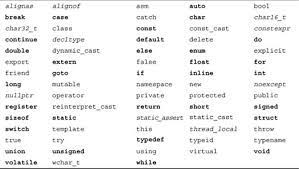

# Keywords and Identifiers

C++ reserves a set of 92 words (as of C++20) for its own use. These words are called keywords (or reserved words), 
and each of these keywords has a special meaning within the C++ language.

Here is a list of C++ keywords:

